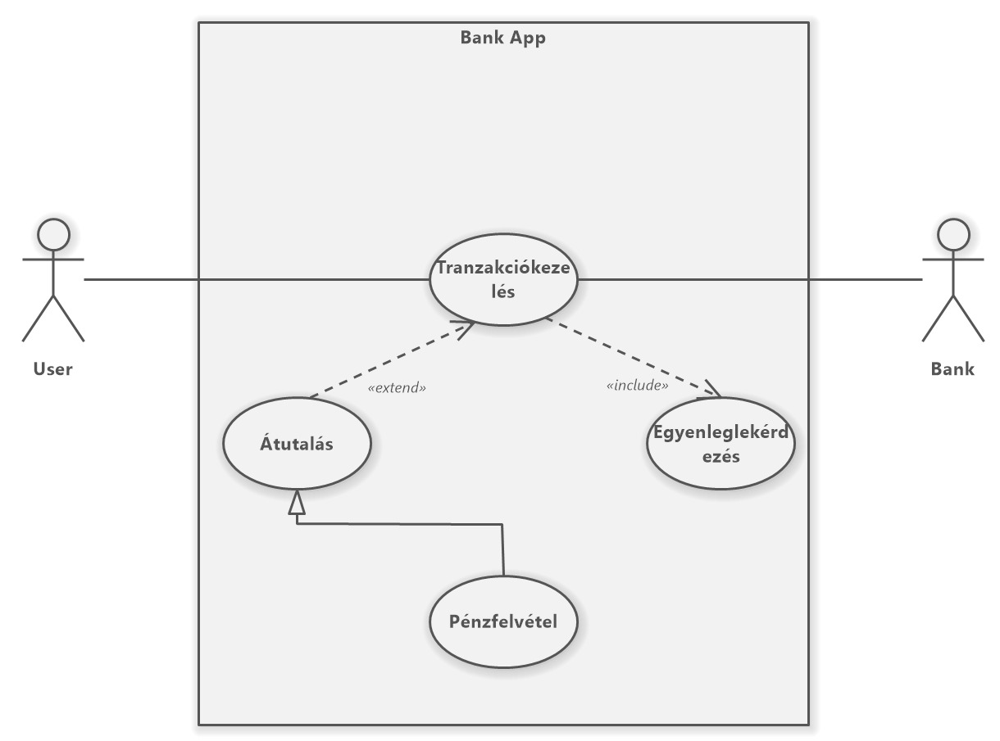
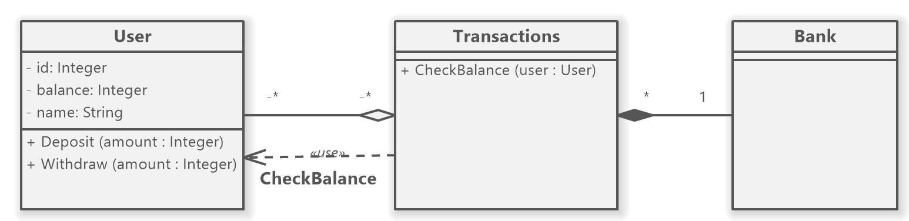

# Dokumentációs feladatok

- User Stories (Felhasználói történetek)
              <table>
                <tr>
                  <th><b><i>User Types</i></b></th>
                  <th><b><i>Epic</i></b></th>
                  <th><b><i>User Stories</i></b></th>
                </tr>
                <tr>
                  <td rowspan="2"><b>User</b></td>
                  <td rowspan="2"><b>Tranzakciókezelés</b></td>
                  <td>Felhasználóként szeretnék tudni pénzt átutalni.</td>
                </tr>
                <tr>
                  <td>Felhasználóként szeretnék tudni pénzt felvenni.</td>
                </tr>
                <tr>
                  <td><b>Bank</b></td>
                  <td><b>Profil menedzsment</b></td>
                  <td>A bank tud profilokat felfüggeszteni.</td>
                </tr>
              </table>
              
- Use Cases (Használati esetek)
    
    ### Kapcsolatok
    * **association** (Az Actor és a Use Case-ek közötti kapcsolat.)
    * **include** (A Use Case működéséhez szükséges.) parent -> child
    * **extend** (A Use Case funkcionalitását bővíti de annak működéséhez nem szükséges.) child -> parent
    * **generalization** (általánosítás/öröklődés)
    
- UML (Osztály-diagram)
    
    ### Kapcsolatok
    * **association** (Egyszerű kapcsolat két osztály között. Egy fekete vonal jelöli.)
    * **aggregation** (Egyirányú kapcsolat, azaz ha egy komponens megszűnik létezni attól még a többi megmarad. Egy üres négyszög és fekete vonal jelöli.)
    * **composition** (Kétirányú kapcsolat, azaz ha egy komponens megszűnik létezni akkor az összes többi megsemmisül. Egy teli négyszög és fekete vonal jelöli.)
    * **usage** (Egyszerű kapcsolat két osztály között mely azt jelöli, hogy melyik osztály használ mit egy másik osztályból. Egy szaggatott vonalú nyíl jelöli.)
