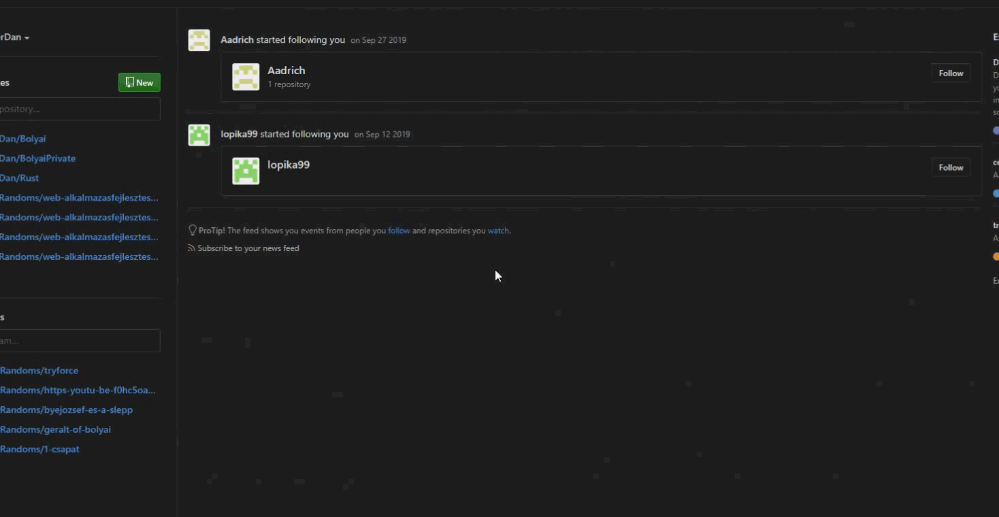
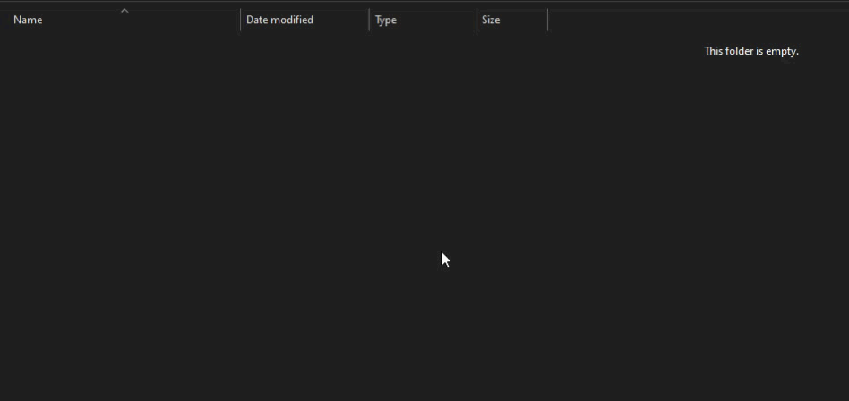

# Git összefoglaló

## git-bash parancsok
### A pontok sorrendben vannak, a parancsok egymásra épülnek

- **Lokális repository, remote repository és clone**
    ```
    git init
    ```
    > ***A lokális repository(mappa a gépeden) inicializálása*** 
   
   
    ```
    git remote add <name> <url>
    ```
    > ***A remote repository(ami a felhőben van) beállítása***
    
    
    ```
    git clone <url>
    ```
    > ***Klónozza(letölti) a remote repository-t, ez már alapból inicializálva van és a remote repository is be van állítva***
    
- **status, add és commit**
    ```
    git status
    ```
    > ***Ezzel a parancsal tudod megnézni, hogy mely fájlokat kell hozzáadnod és, hogy melyik vár commit-ra***
    
    
    ```
    git add .
    ```
    > ***Ezzel a parancsal minden fájlt/mappát hozzáadsz***
    
    
    ```
    git commit -m "Hello World"
    ```
    > ***Ezzel a parancsal tudsz commit-olni(előkészíted arra, hogy fel tudd tölteni a remote repository-ba a munkádat)***
    
- **add és pull**    
    ```
    git push origin master
    ```
    > ***Ezzel a parancsal tudod feltölteni a munkádat a remote repository-ba***
    
    
    ```
    git pull origin master
    ```
    > ***Ezzel a parancsal tudod frissíteni a lokális repository-dat a remote repository által***
    
- **branch, checkout és merge**

    ```
    git branch
    ```
    > ***Listázza a jelenlegi branch-eket***
    
    
    ```
    git branch <name>
    ```
    > ***Létrehoz egy új branch-et a megadott névvel***
    
    
    ```
    git checkout <name>
    ```
    > ***Átlép a megadott nevű branch-re***
    
    
    ```
    git merge <name>
    ```
    > ***Összefésüli azt a branch-et amin állunk(általában a master branch) a megadott nevű branch-el***
    
## Git használat bemutatása

- **Remote repository létrehozása**


- **Local repository inicializálása**


- **Remote és local repository összekötése**


- **git status és git add**


- **git commit és git push**


- **Remote repository frissítve**

