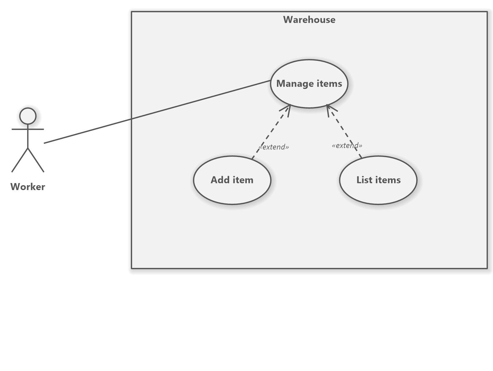

# Assignment 1.

## Használati esetek

## Feladat
Készíts egy UML diagramot valamint egy konzolos applikációt egy raktár termékeinek kezeléséhez.

Adatbázis: **id(primary key, auto increment és int), productName(tinytext), amount(int)**

A programmal a felhasználó(Worker) tudjon új termékeket hozzáadni az adatbázishoz valamint lekérdezni az összes eddig hozzáadott termékeket.

## Pontozás
* 1 pont - Adatbázis helyes létrehozása.
* 3 pont - UML elfogadható megoldása (Megfelelő kapcsolatok használata, nincsenek fölös osztályok).
* 3 pont - Adatbázishoz való csatlakozás megfelelően működik.
* 3 pont - Adatbázisba beszúrás és adatbázisból való lekérdezés megfelelően működik.

**5 pont minimum kell a 2-eshez, 6 pont 3-as, 8 pont 4-es, 9 pont 5-ös.**
