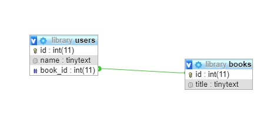
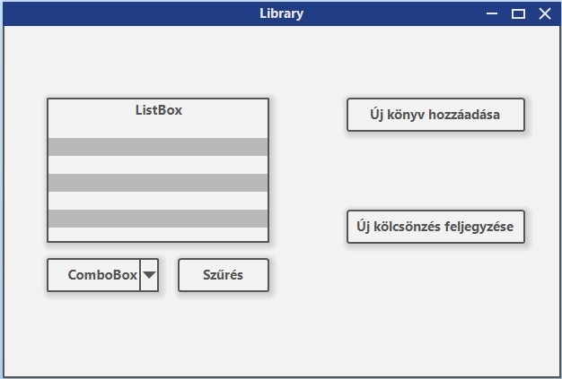

# Assignment 2. | Határidő: 2020.10.31. éjfél
**1 hét csúszással még be lehet adni hármasért.**

## Feladat

Készíts egy alap könyv kölcsönző alkalmazást mely képes hozzáadni új könyveket és feljegyezni, hogy ki melyik könyvet kölcsönözte ki valamint ezt legyen képes
felhasználó szerint kilistázni. Új könyvet és új kölcsönzést külön ablakban intézze a program.

Adatbázis neve: **library**

### Alkalmazás layout

## Pontozás

<table class="tg">
<thead>
  <tr>
    <th class="tg-0pky">Részfeladatok</th>
    <th class="tg-0pky">Pontok</th>
  </tr>
</thead>
<tbody>
  <tr>
    <td class="tg-0lax">Adatbázis megfelelő elkészítése</td>
    <td class="tg-0lax">1 pont</td>
  </tr>
  <tr>
    <td class="tg-0lax">Új könyv hozzáadása</td>
    <td class="tg-0lax">1 pont</td>
  </tr>
  <tr>
    <td class="tg-0lax">Új kölcsönzés feljegyzése</td>
    <td class="tg-0lax">2 pont</td>
  </tr>
  <tr>
    <td class="tg-0lax">Név szerinti listázása a kölcsönzött könyveknek</td>
    <td class="tg-0lax">3 pont</td>
  </tr>
  <tr>
    <td class="tg-0lax"><a href="https://www.dofactory.com/reference/csharp-coding-standards">Konvencióknak</a> megfelel a kód</td>
    <td class="tg-0lax">3 pont</td>
  </tr>
</tbody>
</table>
<table class="tg">
<thead>
  <tr>
    <th class="tg-0pky">Pontok</th>
    <th class="tg-0pky">Jegy</th>
  </tr>
</thead>
<tbody>
  <tr>
    <td class="tg-0lax">5 pont</td>
    <td class="tg-0lax">2</td>
  </tr>
  <tr>
    <td class="tg-0lax">6 pont</td>
    <td class="tg-0lax">3</td>
  </tr>
  <tr>
    <td class="tg-0lax">8 pont</td>
    <td class="tg-0lax">4</td>
  </tr>
  <tr>
    <td class="tg-0lax">9 pont</td>
    <td class="tg-0lax">5</td>
  </tr>
</tbody>
</table>

# <a href="https://forms.gle/y7SLJam55gCkAm5VA">Beadás</a>
