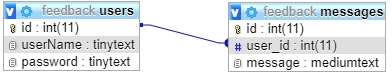
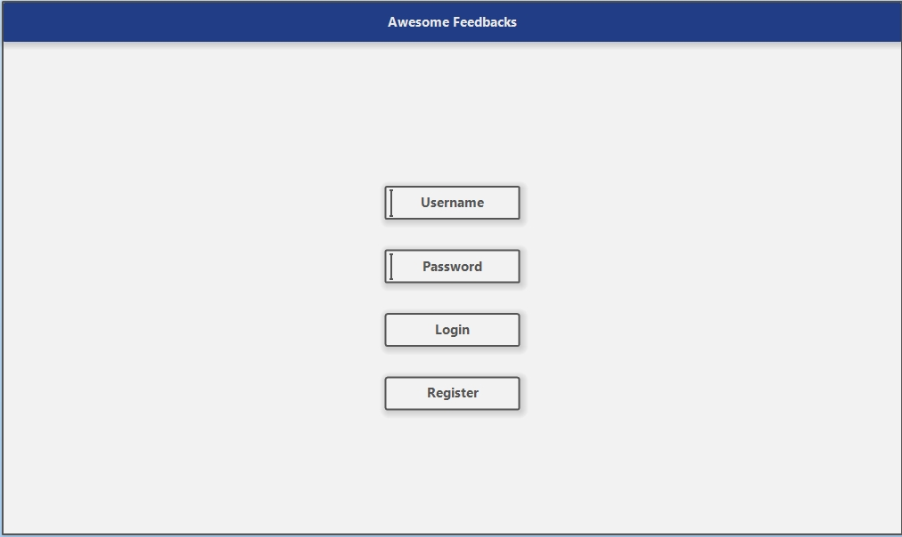

# Assignment 2. | Határidő: 2020.10.31. éjfél
**1 hét csúszással még be lehet adni hármasért.**

## Feladat

Készíts egy weboldalt melyen van egy regisztrációs és bejelentkező felület, bejelentkezés után átvisz egy új oldalra melyen visszajelzéseket lehet írni, ezen az oldalon jelenítse meg azt is, hogy ki van belépve. Használj session-öket és javascript-el ellenőrizd le, hogy a bejelentkezésnél és regisztrácónál ki lett e töltve mindkét mező (felhasználónév, jelszó). **Ha egy felhasználónév már foglalt akkor ne engedjen ugyanazzal regisztrálni!
Értelemszerűen a jelszavak legyenek hash-elve!**

### Alap kód (index.html)
```html
<!DOCTYPE html>
<html lang="en">
<head>
    <meta charset="UTF-8">
    <meta name="viewport" content="width=device-width, initial-scale=1.0">
    <title>Awesome Feedback</title>
</head>
<body>
    <form action="inc/login.inc.php" onsubmit="return checkFields()" method="POST">

    </form>

    <form action="inc/register.inc.php" onsubmit="return checkFields()" method="POST">

    </form>
</body>
<script src="verify.js"></script>
</html>
```
Adatbázis neve: **feedback**



### Layout




## Pontozás

<table class="tg">
<thead>
  <tr>
    <th class="tg-0pky">Részfeladatok</th>
    <th class="tg-0pky">Pontok</th>
  </tr>
</thead>
<tbody>
  <tr>
    <td class="tg-0lax">Adatbázis megfelelő létrehozása</td>
    <td class="tg-0lax">1 pont</td>
  </tr>
  <tr>
    <td class="tg-0lax">Regisztráció (úgy, hogy egy felhasználónév csak egszer szerepelhet a users táblában)</td>
    <td class="tg-0lax">2 pont</td>
  </tr>
  <tr>
    <td class="tg-0lax">Bejelentkezés</td>
    <td class="tg-0lax">1 pont</td>
  </tr>
  <tr>
    <td class="tg-0lax">Session-ök használata</td>
    <td class="tg-0lax">2 pont</td>
  </tr>
  <tr>
    <td class="tg-0lax">Felhasználónév megjelenítése a dashboard-on</td>
    <td class="tg-0lax">1 pont</td>
  </tr>
  <tr>
    <td class="tg-0lax">Feedback üzenet megfelelő beszúrása az adatbázisba</td>
    <td class="tg-0lax">3 pont</td>
  </tr>
  <tr>
    <td class="tg-0lax"><b>Opcionális:</b> CSS-el formázd meg a weboldalt tetszés szerint</td>
    <td class="tg-0lax">2 pont</td>
  </tr>
</tbody>
</table>

<table class="tg">
<thead>
  <tr>
    <th class="tg-0pky">Pontok</th>
    <th class="tg-0pky">Jegy</th>
  </tr>
</thead>
<tbody>
  <tr>
    <td class="tg-0lax">5 pont</td>
    <td class="tg-0lax">2</td>
  </tr>
  <tr>
    <td class="tg-0lax">6 pont</td>
    <td class="tg-0lax">3</td>
  </tr>
  <tr>
    <td class="tg-0lax">8 pont</td>
    <td class="tg-0lax">4</td>
  </tr>
  <tr>
    <td class="tg-0lax">9 pont</td>
    <td class="tg-0lax">5</td>
  </tr>
</tbody>
</table>

# <a href="https://forms.gle/seSv5nGu5cwukVPv5">Beadás</a>
